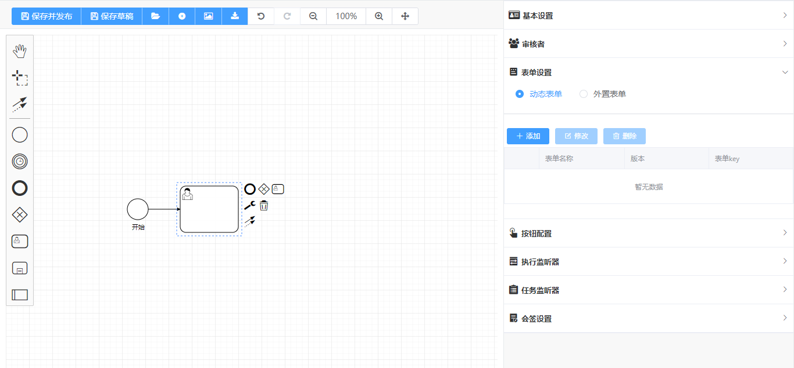
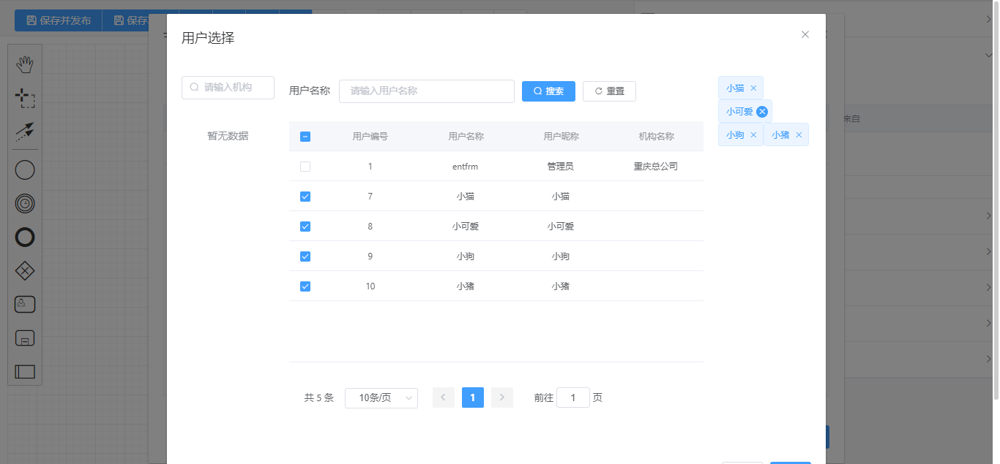
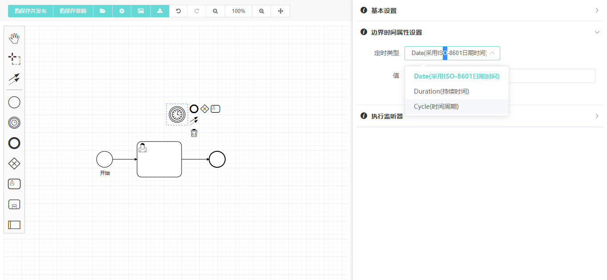

# entfrm商业版Flowable设计器

---
> 商业版介绍:
---
> 商业版参考文档:
---
> 购买地址:
---


一个基于 `bpmn.js`，`Vue 2.x` 和 `ElementUI` 开发的Flowable流程设计器。

您可以使用它在浏览器上查看和编辑符合 `BPMN 2.0` 规范的流程文件。

演示请访问 [entfrm开发平台](http://demo.entfrm.com/)

## 1. 安装依赖 Installation

```shell
npm install
// or yarn install
```

## 2. 运行 Quick Start

```shell
npm run serve
// or yarn run serve
```

## 3. 演示


<hr/>


<hr/>


