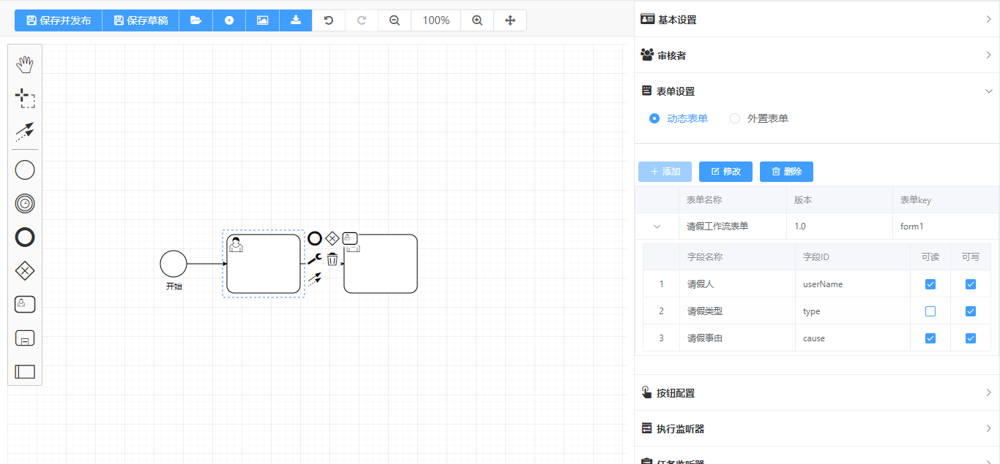
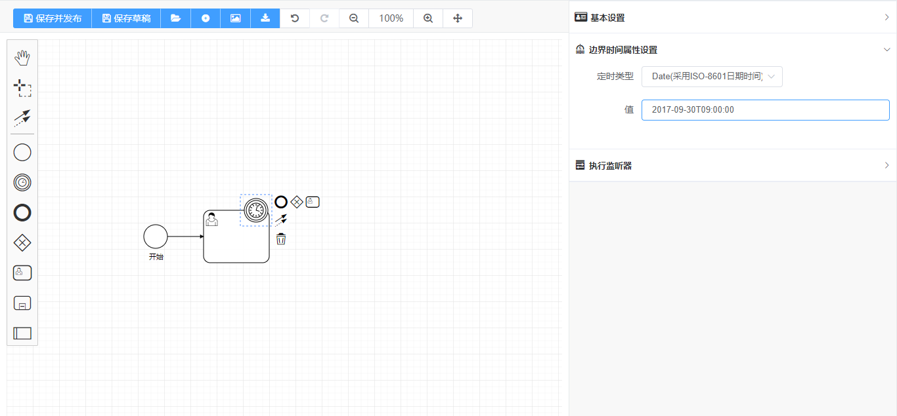

# entfrm商业版Flowable设计器

---
> 商业版介绍:
> 源代码清晰可读,必要的地方都上了注释,
> 非常方便后续的维护与其他开发人员二次开发,
> 包括细节方面已经做的非常到位,简洁客观
---
> 商业版参考文档: http://demo.entfrm.com/
---
> 购买地址: http://demo.entfrm.com/
---


一个基于 `bpmn.js`，`Vue 2.x` 和 `ElementUI` 开发的Flowable流程设计器。

您可以使用它在浏览器上查看和编辑符合 `BPMN 2.0` 规范的流程文件。

演示请访问 [entfrm开发平台](http://demo.entfrm.com/)


## 1. 安装依赖 Installation

```shell
npm install
// or yarn install
```

## 2. 运行 Quick Start

```shell
npm run serve
// or yarn run serve
```

## 3. 详细介绍
> 具体核心封装了bpmn.js建模工具(https://github.com/bpmn-io/bpmn-js.git)
> 并且对外提供全局配置做到轻松改参数就可以实现一些功能需求,对外提供预览组件跟设计组件
> bpmn预览组件可以根据流程更换颜色也可以由用户自定义颜色

## 4. 演示


<hr/>


<hr/>


<hr/>


<hr/>


